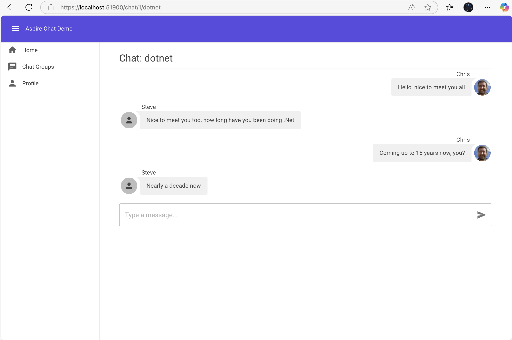
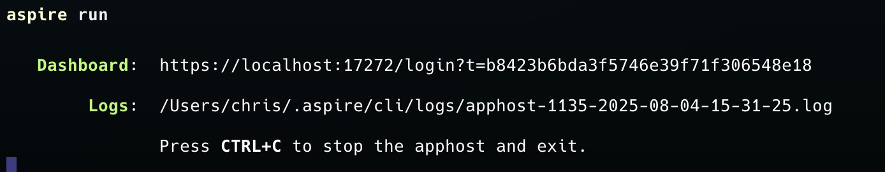

# Aspire Chat Demo

A modern, real-time chat application built with .NET Aspire and Azure, designed to demonstrate cloud-native application development patterns. This project is part of a blog series exploring how to leverage .NET Aspire with Azure services.

## 🌟 Overview

This chat application showcases the power of .NET Aspire to simplify building distributed, cloud-native applications. It demonstrates how to integrate various Azure services with a modern .NET stack to create a scalable, resilient real-time application.

## 🏗️ Architecture

The application follows a microservices-inspired architecture with:

- **API Backend**: FastEndpoints-based API handling chat messages and user data
- **Web Frontend**: Blazor Server application providing the user interface
- **Infrastructure**: Redis for caching and pub/sub, SQL Server for data persistence, and Azure Storage for file attachments

**Aspire Dashboard**


**Dependency Graph**


**Application**


## 🛠️ Technologies

- **.NET Aspire**: Cloud-ready stack for building observable, production-ready distributed applications
- **FastEndpoints**: High-performance API framework that promotes REPR pattern (Request-Endpoint-Response)
- **Blazor Server**: Interactive web UI framework using C# instead of JavaScript
- **ASP.NET Core SignalR**: Real-time messaging between API and Blazor clients (group-based updates with service discovery)
- **Entity Framework Core**: ORM for data access and database operations
- **Redis**: In-memory data store for caching and pub/sub messaging
- **Azure SQL Database**: Managed relational database service
- **Azure Blob Storage**: Scalable object storage for images and file attachments
- **Azure Container Apps**: Hosting environment for containerized applications

## 📊 Project Structure

- **AspireChat.AppHost**: Orchestrates all services and infrastructure components
- **AspireChat.Api**: Backend API service using FastEndpoints
- **AspireChat.Web**: Blazor Server frontend application
- **AspireChat.ServiceDefaults**: Shared service configuration and defaults

## 🚀 Getting Started

### Prerequisites

- .NET 9 SDK
- Docker Desktop
- Jetbrains Rider, Visual Studio 2022 or later / VS Code with C# Dev Kit
- Aspire Cli
- Azure subscription (for deployment)

### Local Development

1. Clone the repository:
   ```
   git clone https://github.com/yourusername/aspire-chat-demo.git
   cd aspire-chat-demo
   ```

2. Install the Aspire Cli
   ```
   dotnet tool install -g Aspire.Cli
   ```
   
3. Run the application with Aspire dashboard:
   ```
   cd AspireChat/AspireChat.AppHost
   aspire run
   ```

4. Navigate to the Aspire dashboard to view and manage your services


### Deployment to Azure

The blog series will cover step-by-step deployment to Azure using:
- Azure Container Apps for hosting services
- Azure SQL Database for data persistence
- Azure Cache for Redis
- Azure Blob Storage for file storage

## 📝 Blog Series

This Project is the foundation for several blog posts.
The series will cover the following topics:
- Getting started with .NET Aspire
- Building a real-time chat application with Blazor and FastEndpoints
- Integrating Azure services with .NET Aspire

Stay tuned for links to each blog post as they are published!

## 📄 License

This project is licensed under the MIT License - see the LICENSE file for details.

## 🙏 Acknowledgements

- Microsoft .NET team for Aspire
- The FastEndpoints and Blazor teams
- All contributors and the .NET community


## ⚡ Real-time messaging with SignalR

This project now uses ASP.NET Core SignalR for real-time chat updates.

- Hub endpoint: `GET/WS /hubs/groupchat` on the API service.
- Grouping model: Clients join a group per chat using `JoinGroup(groupId)` and leave via `LeaveGroup(groupId)`.
- Broadcasts: When a message is sent to the API (`POST /chats/{groupId}`), the API persists it and then publishes the message to all clients in that group using `IHubContext<GroupChatHub>.Clients.Group(groupId).SendAsync("ReceiveMessage", dto)`.
- Client: The Blazor Server app establishes a `HubConnection` to `/hubs/groupchat`, sets a JWT access token (so the hub can identify the user), and subscribes to `ReceiveMessage`.

### Service discovery aware SignalR client
The app is run via .NET Aspire and uses service discovery so that the API is addressed as `https://api`. To ensure SignalR’s negotiate and HTTP-based transports resolve via service discovery, the Blazor client configures the SignalR HTTP pipeline to use `IHttpMessageHandlerFactory` from `IHttpClientFactory`:

- Base address: `https://api`
- Hub URL: `https://api/hubs/groupchat`
- Negotiation: Routed through the Aspire service discovery handler, so no direct DNS resolution of `api` is required.

### Authentication
- Users authenticate via the API (login/register endpoints) and receive a JWT.
- The web app stores this token in protected session storage and uses it for both HTTP requests and SignalR via `AccessTokenProvider`.
- The user id claim (sid/nameid/etc.) is read on the client to determine whether a message is “mine” (right-aligned) or “theirs” (left-aligned).

### Try it locally
1. Start the solution with Aspire (see Getting Started).
2. Open the web app in two different browsers or profiles (e.g., Chrome and Edge), register/login as two different users.
3. Navigate to a group chat in both windows; when one user sends a message, the other should see it instantly without page refresh.

### Troubleshooting
- If SignalR fails to connect with errors about `api` DNS resolution or negotiate: ensure the client uses the Aspire service discovery message handler. This repository configures it in the SignalR client via `HttpMessageHandlerFactory`.
- If messages all align on the left: make sure you’re signed in and the client can read the user id claim from the JWT.
- Ensure WebSockets are permitted by your reverse proxy or dev environment; SignalR will fall back to other transports if needed.
